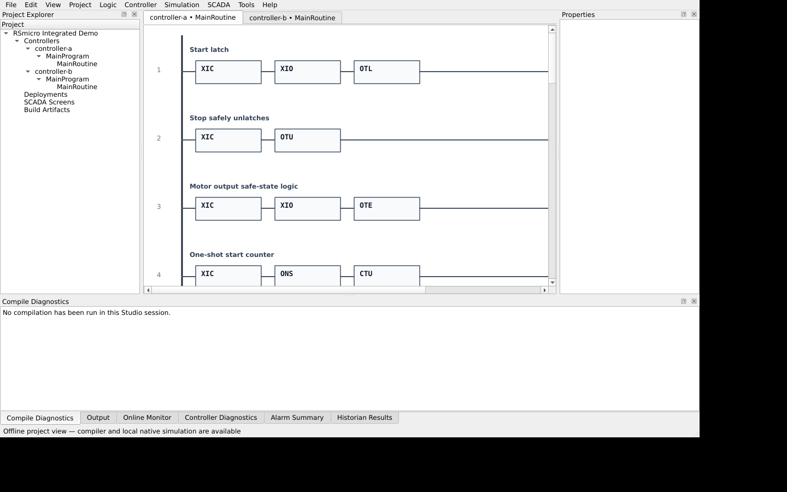
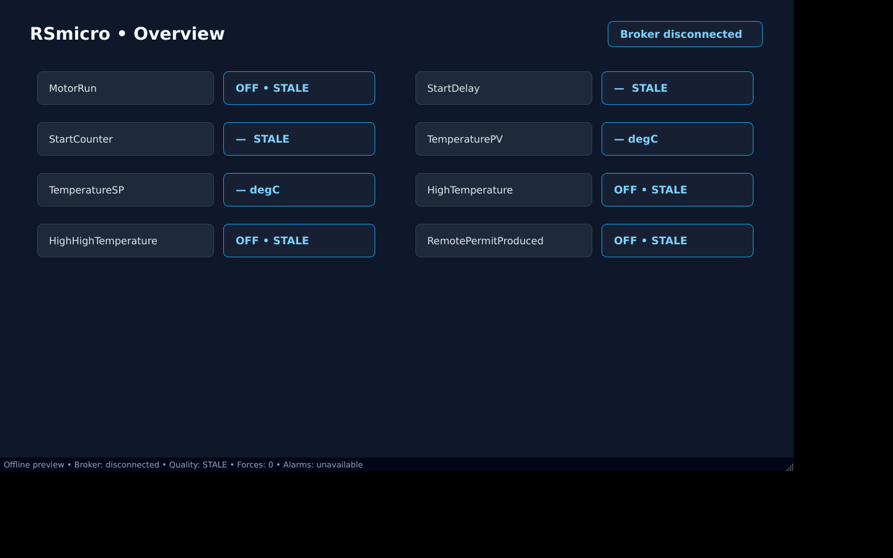

# RSmicro

A deterministic ladder-logic compiler, portable C99 execution core, native simulator, and experimental engineering/SCADA desktop tools.

> **Safety:** RSmicro is experimental, unaudited control software. It is not safety-certified and must never replace emergency stops, guards, overload protection, or safety-rated control. RSM Link is currently unauthenticated and unencrypted; keep it on loopback or an isolated trusted network.

## What you can use today

- Validate canonical `.rsmproj` projects with structured diagnostics.
- Compile controllers deterministically to portable `.rsm` program images.
- Inspect image metadata, sections, routes, and compatibility versions.
- Execute projects in the C99 core through the Python native simulator.
- Open canonical projects and inspect rendered ladder routines in Studio.
- Load and preview canonical SCADA screens through the same parser used by repository validation.
- Use the preserved `plc-ascii` Tk workbench for legacy local simulation and board-oriented workflows.

The supported software contract is **RSM-LOGIX-CORE-1 profile 2.0.0**, instruction ABI **2**, image format **2.0**, and runtime ABI **1.2**.

## Screenshots

### Studio — offline project and ladder inspection



### SCADA — canonical offline screen preview



The SCADA screenshot is intentionally marked **Broker disconnected / STALE**. Live node-to-broker-to-SCADA data flow is not implemented yet.

## Five-minute start

### Requirements

- Python **3.11+**
- CMake **3.20+**
- A C99 compiler: GCC/Clang on Linux/macOS or Visual Studio Build Tools on Windows

```bash
git clone https://github.com/speccy88/RSmicro.git
cd RSmicro
python3 -m venv .venv
source .venv/bin/activate              # Windows: .venv\Scripts\activate
python -m pip install --upgrade pip
pip install -e .
```

Build the shared native core in the default discoverable `build/` directory:

```bash
rsmicro native build --clean --release
rsmicro native info
```

Validate, compile, and inspect the integrated example:

```bash
rsmicro validate examples/integrated_demo/project.rsmproj
mkdir -p build/demo
rsmicro compile examples/integrated_demo/project.rsmproj \
  --controller controller-a \
  --output build/demo/controller-a.rsm \
  --manifest build/demo/controller-a.manifest.json \
  --debug-map build/demo/controller-a.debug.json
rsmicro inspect-image build/demo/controller-a.rsm
```

Run it in the real C core through the native simulator:

```bash
rsmicro run-native examples/integrated_demo/project.rsmproj \
  --controller controller-a \
  --mode run --duration 0.25 \
  --show-tags --show-diagnostics --format json
```

Open the desktop views:

```bash
rsmicro-studio examples/integrated_demo/project.rsmproj
rsmicro-scada --project examples/integrated_demo/project.rsmproj \
  --screen overview --role viewer
```

See the [complete beginner tutorial](docs/tutorial.md) for expected output, headless verification, custom library paths, troubleshooting, and the legacy workbench.

## Current project status

| Area | Status |
| --- | --- |
| Canonical model and compiler | **Usable for experimentation** — complete compiler-owned admission and deterministic images |
| Portable C99 core | **Usable for host experimentation** — strict and sanitizer tested; caller-owned arena |
| Python native simulator | **Usable locally** — lifecycle, snapshots, traces, unload/reload, and concurrent access covered |
| Studio | **Offline preview** — project tree and ladder rendering work; most engineering actions are not wired |
| SCADA screens | **Offline preview** — canonical schema and rendering work; live broker updates/writes are not connected |
| `rsmicro-tagd` | **Foundation only** — configuration/API scaffolding; no proven live controller data flow |
| `rsm-node` | **Foundation only** — socket/configuration shell; not a protocol-serving cyclic controller |
| Legacy `plc-ascii` | **Preserved** — Tk editor/local simulator and board tooling; hardware remains unverified here |
| Production/safety control | **No-go** |

Linux is exercised locally. Linux, macOS, and Windows have checked-in CI workflows, but a platform is not claimed as passing until its hosted workflow is visibly green. Physical CircuitPython, MicroPython, Raspberry Pi, and Propeller 2 behavior is **UNVERIFIED** by the current release evidence.

Read [current status](docs/current-status.md), [release readiness](docs/release-readiness.md), and [native node status](docs/native-node.md) before planning integration work.

## Architecture

```text
canonical .rsmproj
       │
       ├── validate / compile ──> deterministic .rsm image ──> rsmcore
       │                                                     └── Python native simulator
       ├── Studio ──> offline project/routine inspection
       └── SCADA references ──> canonical screen loader ──> offline operator preview

future live path: rsm-node <─RSM Link─> rsmicro-tagd <─WebSocket─> SCADA
```

## Verification for contributors

```bash
python tools/generate_instruction_registry.py --check
python tools/generate_c_conformance_fixtures.py --check
python tools/generate_rsm_link_registry.py --check
cmake -S . -B build -DRSM_BUILD_TESTS=ON -DRSM_BUILD_SHARED=ON -DRSM_ENABLE_STRICT_WARNINGS=ON
cmake --build build --config Release --parallel
ctest --test-dir build -C Release --output-on-failure
pytest -q
ruff check .
mypy src/rsmicro
PYTHONPATH=src python tools/validate_repository.py --format text
python -m build
```

The deterministic integrated smoke is deliberately bounded:

```bash
PYTHONPATH=src python tools/run_integrated_demo.py --headless --format json
```

It compares separately written program images and inspects both. It does **not** claim that nodes, broker routing, Studio online mode, live SCADA, or physical hardware work.

## Legacy PLC ASCII workbench

```bash
plc-ascii examples/demo_program.json
plc-ascii-cli examples/demo_program.json
plc-runtime --demo
```

The legacy Tk application supports basic ladder editing, local simulation, forcing, JSON-line runtime transport, and preserved CircuitPython/Propeller tooling. These paths are separate from the canonical compiler/C-core architecture.

## License and contributions

This project is still pre-production. Contributions should include executable tests, keep generated artifacts deterministic, and avoid claims that exceed measured evidence.
